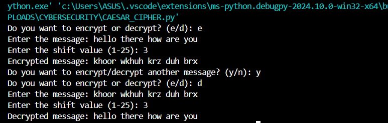
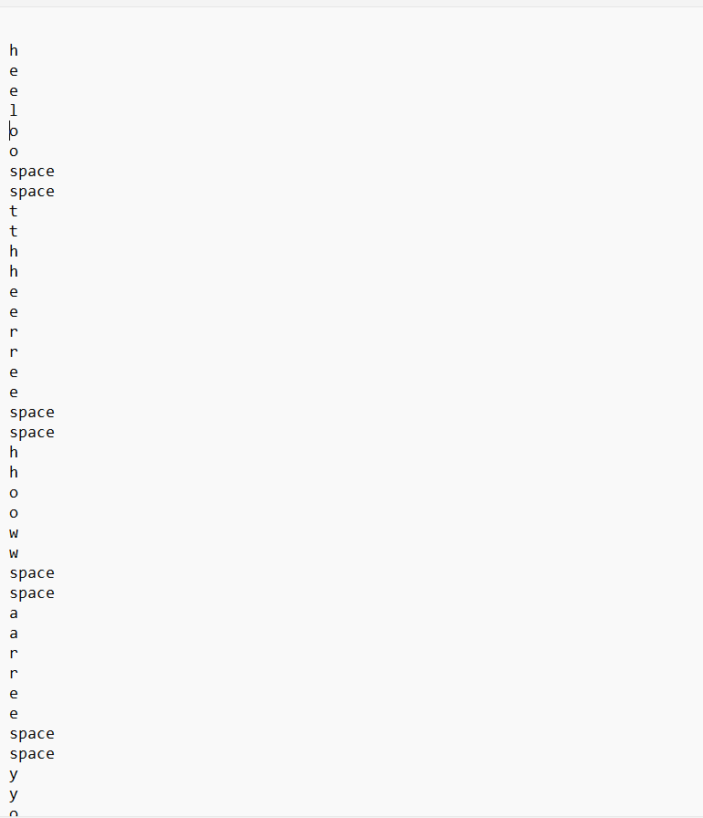
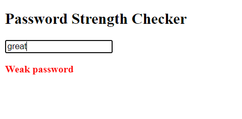
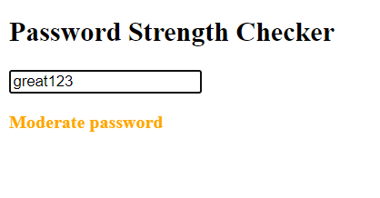
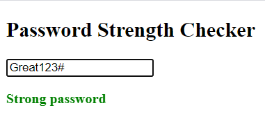

## Cybersecurity intern @ Prodigy Infotech

This repository contains four projects showcasing various programming concepts and techniques. Below is an overview of each project and instructions on how to use them.

## Projects

1. [Caesar Cipher](#1-caesar-cipher)
2. [Pixel Manipulation for Image Encryption](#2-pixel-manipulation-for-image-encryption)
3. [Keylogger.py](#3-keyloggerpy)
4. [PasswordCheck.html](#4-passwordcheckhtml)

### 1. Caesar Cipher

The Caesar Cipher is a simple encryption technique where each letter in the plaintext is shifted a certain number of places down or up the alphabet. This project demonstrates the implementation of the Caesar Cipher in Python.

#### Features
- Encryption and Decryption
- Customizable shift value

### Preview

### 2. Pixel Manipulation for Image Encryption

This project demonstrates a method of encrypting an image by manipulating its pixels. The encrypted image can be decrypted to retrieve the original image.

#### Features
- Image encryption and decryption
- Simple and effective pixel manipulation techniques

### Preview
<b>Decrypted Image</b> 

<b>Encrypted Image</b> 

### 3. Keylogger.py

This project implements a basic keylogger in Python, which captures and logs keystrokes.

#### Features
- Captures keystrokes
- Logs keystrokes to a file

### Preview
The notepad display showing the logged values 

### 4. PasswordCheck.html

This project provides a simple HTML form to check the strength of a password. It uses JavaScript to evaluate the strength based on various criteria.

#### Features
- Password strength evaluation
- Real-time feedback

### Preview

## Contact

For any questions or inquiries, please contact nehaannie2002@gmail.com

